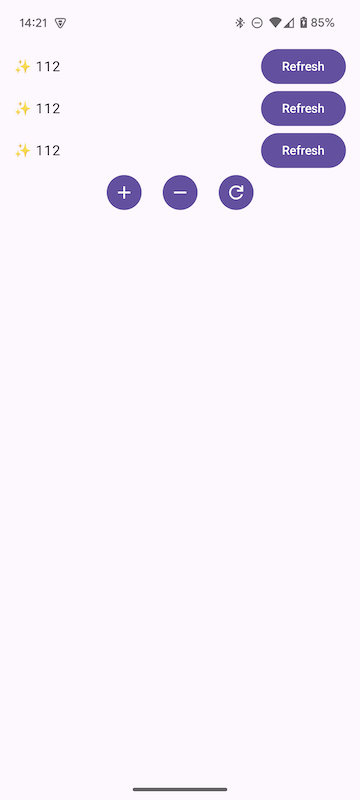

# Soil Demo

ブログ記事「Jetpack Composeで始めるServer Cache State」向けに用意した簡単なデモコードです。

- [APK](https://github.com/ogaclejapan/soil-demo/raw/refs/heads/main/app-release.apk)

このデモコードは、次のような確認に役立ちます。

- AndroidプロジェクトへのSoil Queryセットアップ
- DI（Dagger Hilt）を利用したSwrClientの生成管理
- Queryの処理状態
- Queryの同時実行制御
- Queryの再取得・リトライ処理
- Query増減によるライフサイクル（非アクティブ化）・キャッシュ挙動
- Query依存コンポーネントのプレビュー・テスト

GitHubのstar数をAPI経由で取得して表示する簡単なコンポーネントが実装されています。
この表示コンポーネントを動的に増減させることで擬似的に複数箇所での同時利用を再現します。

